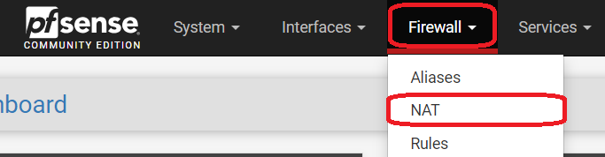
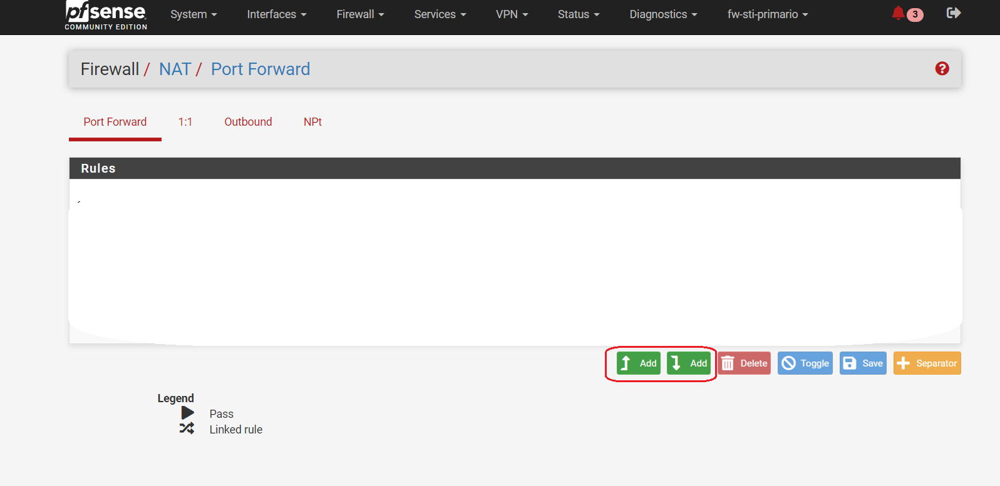
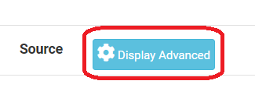
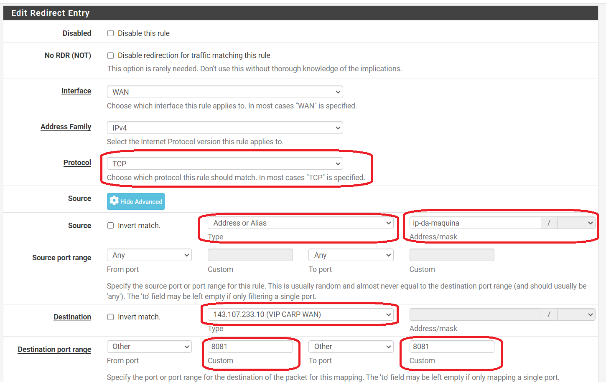
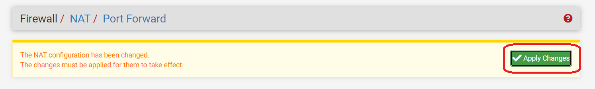

# Firewall

Aplicação que permite liberar regras de acesso via nat reverso em firewalls mediante senha única.

Implementado para pfsense.

O sistema precisa ter acesso ssh por chave no pfsense.

Como adicionar regras de nat:
* Na página inicial do pfSense, clique em "nat" dentro do menu Firewall

* Na tela seguinte, escolha o primeiro botão circulado em vermelho se quiser adicionar uma regra ao topo da lista ou o segundo botão se quiser adicionar ao fim

* Na tela de adionar regra, clique em "Display Advanced" no campo de "source"

* Nos demais campos, certifique-se que seguem as mesmas especificações das imagens a seguir. Substitua 'ip-da-maquina' pelo ip da máquina que será utilizada

* Após aplicadas as modificações, clique em "Save"
* Na tela seguinte, clique em "Apply changes"

Procedimento de deploy padrão para Laravel
* senha única
* migrations
* etc

rodar `php artisan atualizarRemotos` é necessário copiar um script no pfsense (resourcers/pfsense/Pfsense-config3.php)

Gerar e configurar chave SSH
1. Gerar uma chave SSH

    Abra um terminal e execute: `ssh-keygen`
    Insira um caminho para a chave ou aperte enter para seguir com o caminho padrão

    Verifique as chaves geradas no diretório .ssh, se foi mantido o caminho padrão
    Se foi indicado outro caminho, as chaves geradas devem estar lá
    (a chave pública é a que possui a extensão de arquivo .pub)

2. Adicionar a chave pública ao pfSense

    Faça login na interface web do pfSense.
    Você deve adicionar sua chave SSH ao usuário admin através da página de gerenciamento de usuários. 
    Cole sua chave pública SSH na caixa de texto Chaves SSH autorizadas e clique em Salvar mais uma vez.

3. Configurar o caminho da chave privada

    Abra o arquivo .env em seu projeto e verifique o caminho indicado na variável pfsense_private_key
    Copie ambas as chaves para o caminho indicado dentro da pasta storage e renomeie como 'acesso-pfsense'.
    (padrão /firewall/storage/app)